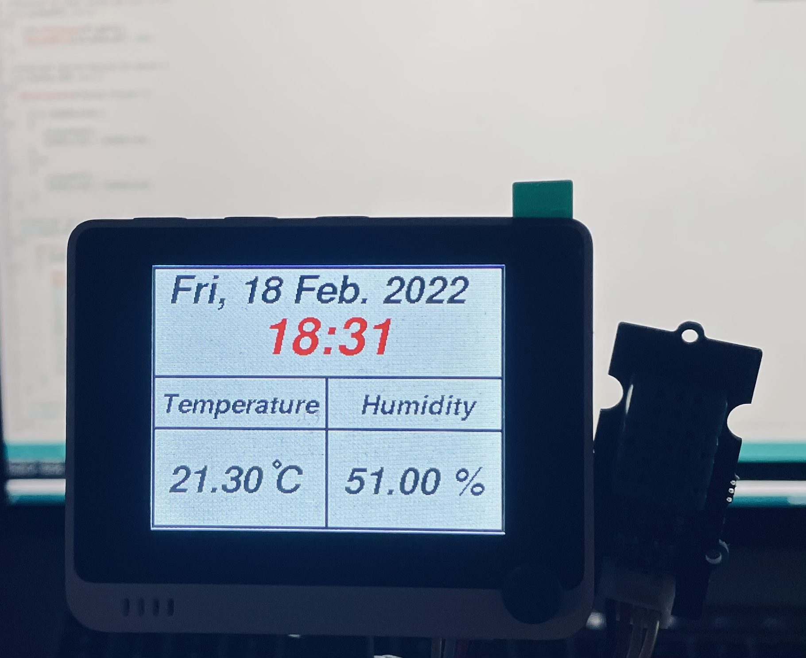

# Simple Weather Station.
This is a am simple Weather station that is made of two pysical components:
- Seeed Wio Terminal ([Here](https://wiki.seeedstudio.com/Wio-Terminal-Getting-Started/))
- Grove Temperature&Humidity Sensor (DHT11) ([Here](https://wiki.seeedstudio.com/Grove-TemperatureAndHumidity_Sensor/))

I would want to assume you know how to add the board to your Arduino Board Manager. However, if that is not the case, kindly read through this [wiki](https://wiki.seeedstudio.com/Wio-Terminal-Getting-Started/). To use these code the following, please do the follow.
1. rename the *config_.h*  to *config.h*
2. fill in the content especially your wifi and password. You can leave the NTP parameter as is
3. Install the following into your library if not already there.
    - Seeed *Arduino rpcWiFi* (version: 1.0.5)
    - Seeed *Arduino rpcUnified* (version: 2.1.3)
    - Seeed *Arduino RTC* (version: 2.0.0)

The content of the code is well commented to carry you along. Take your time to go through it as this isn't the usual weather station. It tries to intoduce you to other simple functionality like interrupts, usage of the WiFi, Real time clock updating etc.. 

## How it works
1. When system comes on, it connects to your WiFi given the credentials are valid
2. It updates time via a NTP server
    - if successful, the RTC updates with the network time
    - if unsuccessful, the RTC updates with the compile system time.
3. An alarm is set for ticking the time every one minute
4. It attaches an interrupt for the wake up button
5. Displays the screen momentarily before turning it off.

To turn on the screen, Press *Button_C* (changeable) and same button to turn off the screen. The screen also turns of before or after a maximum period of 5mins.

Here's a picture of what the weather station looks like:

